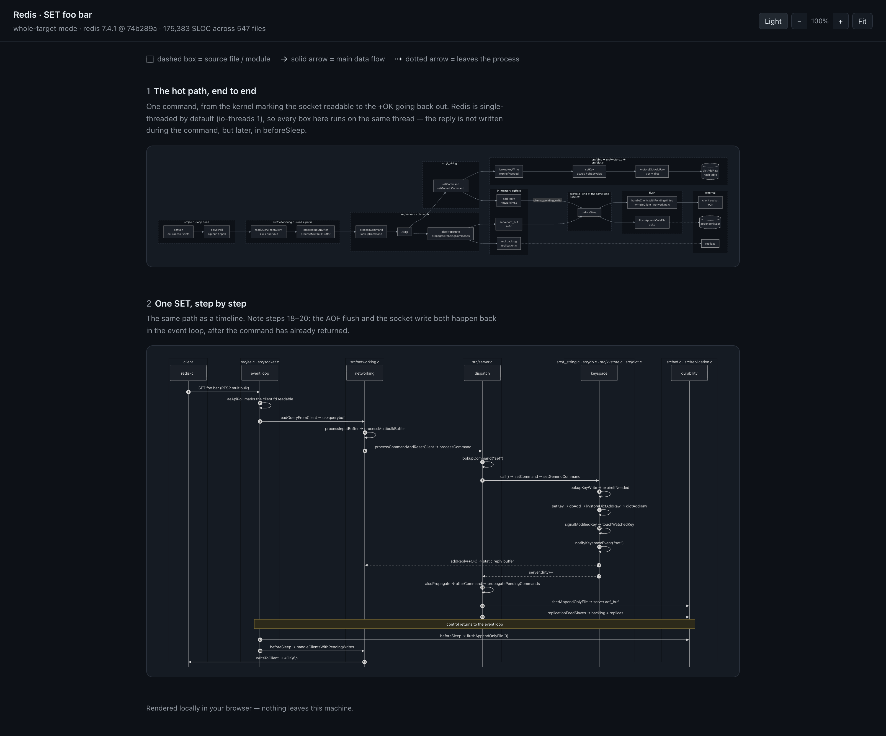
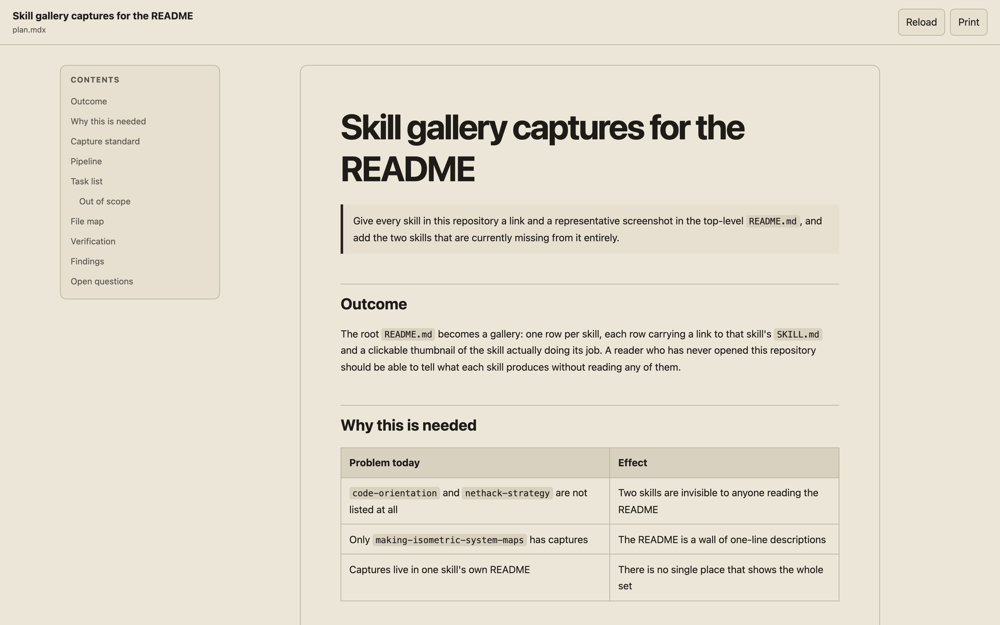
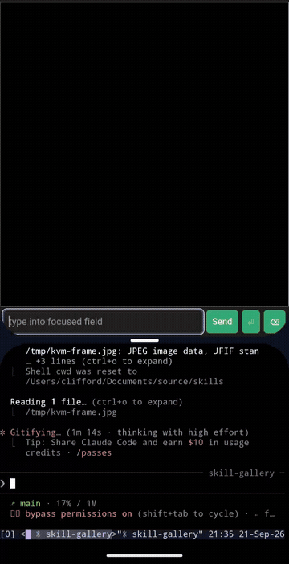
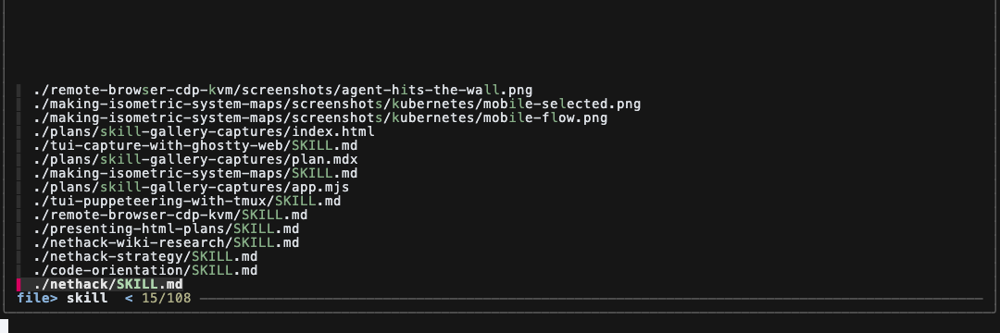
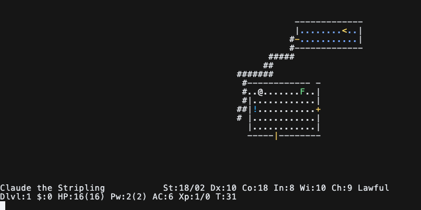

# Skills

Personal, reusable agent skills for planning, browser and terminal automation.

Every capture below is a real, unretouched recording or screenshot of the skill
running — no mockups and no composites. Click any image to view the original.

| Skill | Capture |
| --- | --- |
| **[code-orientation](code-orientation/SKILL.md)**  Turn "I don't know this code yet" into numbers, a map, and a picture of the hot path. Main fiew is: SLOC breakdown, annotated file tree, and diagrams served locally. Point it at a repo, a subfolder, a dependency, or a PR range.  *Shown: `redis` 7.4.1 at [`74b289a`](https://github.com/redis/redis/tree/74b289a0e12f9f65a6daeec6a66cadc76792f644), 175,383 SLOC across 547 files, tracing one `SET foo bar`.* |  |
| **[presenting-html-plans](presenting-html-plans/SKILL.md)**  Present a finished plan as a source-controlled local HTML page with Mermaid diagrams, content nav, and print styles. HTML viewer is quick to read and understand, but the plan stays MDX so it is also quick for the agent to read and understand.  *Shown: [the plan for this gallery](plans/skill-gallery-captures/plan.mdx), rendered by the bundled scaffold.* |  |
| **[making-isometric-system-maps](making-isometric-system-maps/README.md#kubernetes-gallery)**  Draft: interactive isometric system maps. Select a component to light up its relationships, or trace a flow step by step with automatic camera moves  *Shown: a Kubernetes Deployment and ClusterIP Service, mid flow-trace. [More captures](making-isometric-system-maps/README.md#kubernetes-gallery).* |  |
| **[remote-browser-cdp-kvm](remote-browser-cdp-kvm/SKILL.md)**  Drive one persistent, logged-in Chrome over CDP through small repeatable verbs, and hand human-only steps (login, CAPTCHA, SSO, 2FA, sign-off) to a private phone-friendly KVM over your tailnet.  *Shown: agent shares "I'm not a robot" screen to the human, and tailnet plus Android split screen makes it easy to interact with the agent and browser both. Real recording, obviously sped up.* |  |
| **[tui-puppeteering-with-tmux](tui-puppeteering-with-tmux/SKILL.md)**  Isolated tmux sessions for automating and testing TUI and CLI applications, with scripts for input, output capture, and state assertions. Sessions live on a dedicated socket, so a run can never touch your own tmux.  *Shown: `fzf` driven inside an isolated session — the query `skill` was sent with `tui-send`, then `tui-assert` proved `SKILL.md` appeared. The `15/108` counter is the state the assertion checked.* |  |
| **[tui-capture-with-ghostty-web](tui-capture-with-ghostty-web/SKILL.md)**  Capture a tmux-driven TUI as paired plain-text and Ghostty Web PNG artifacts, for visual QA, documentation, and screenshot regression evidence. | _capture pending_ |

Each skill's code and instructions live under its own directory.

## License and provenance

Original work is available under the [MIT License](LICENSE). Imported components
and unresolved redistribution terms are documented in [NOTICE](NOTICE). This
repository should remain private until every component marked there for review
has been cleared or removed.

## Extras!

The NetHack harness, plus two advisory skills that ride alongside it. The two
advisory skills have no visual output, so they are listed but not illustrated.

| Skill | Capture |
| --- | --- |
| **[nethack](nethack/SKILL.md)**  Compact, observed NetHack control through the bundled Rust `nh` harness — movement, combat, prompts, inventory, and run-state reporting against a live game in an isolated tmux session. The harness captures before and after every key, classifies the event, and refuses input it cannot interpret rather than guessing.  *Shown: a real game at turn 31 — Claude the Stripling, a lawful human Valkyrie on Dlvl 1, two rooms and the connecting corridor explored, a lichen (`F`) east and an unidentified potion (`!`) southwest.* |  |
| **[nethack-strategy](nethack-strategy/SKILL.md)**  Live strategy guidance: useful exploration, early retreat, timely item use, limited pet rescue, and clear reasons to leave a bad fight. | — |
| **[nethack-wiki-research](nethack-wiki-research/SKILL.md)**  Bounded local-wiki research delegated to a sub-agent, so raw source material never enters the playing agent's context. | — |

Large local NetHackWiki and official-source archives are runtime data and
intentionally are not tracked.
