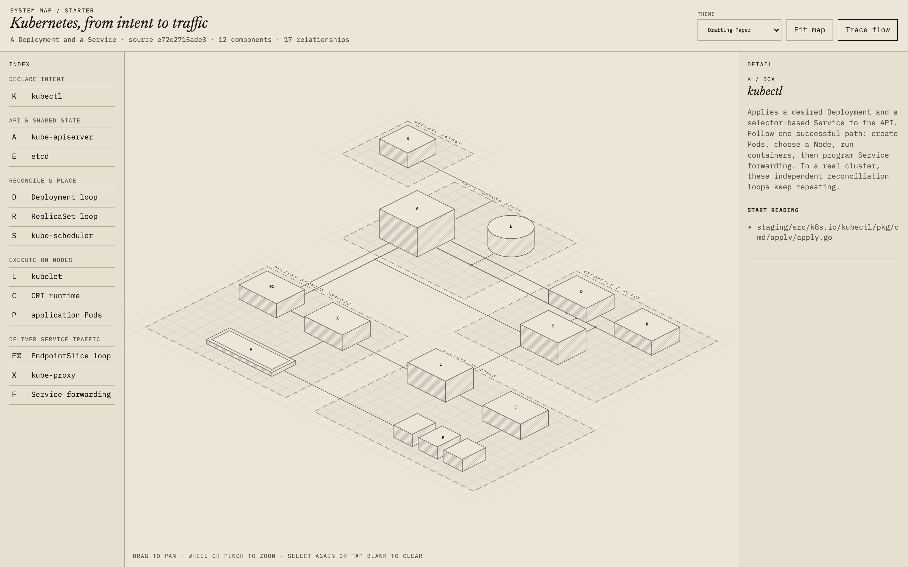
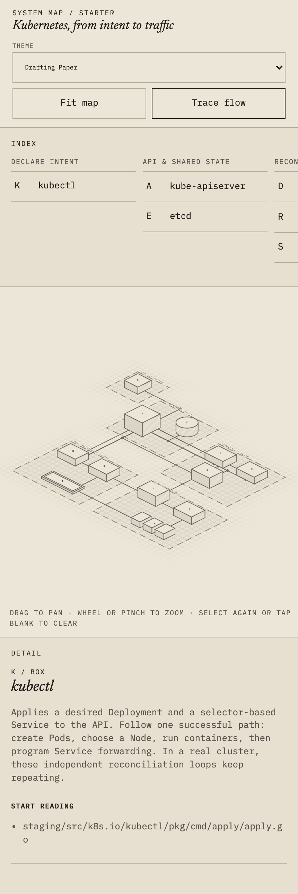
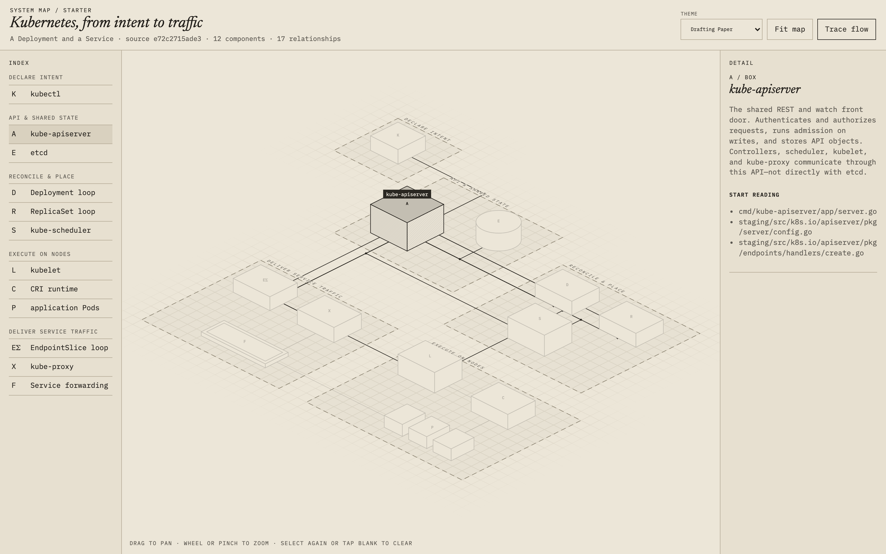
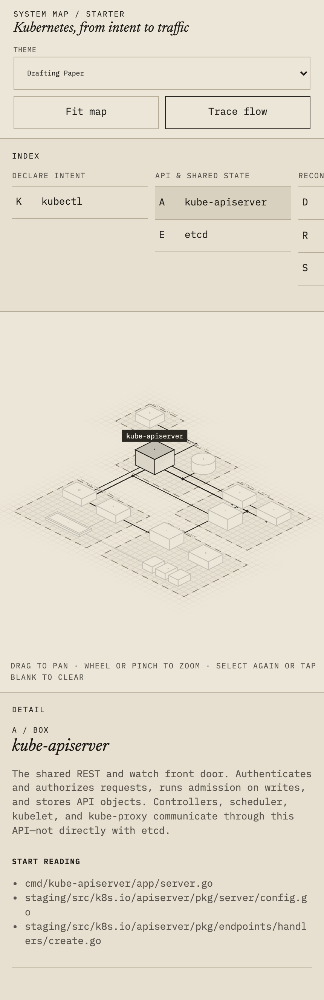
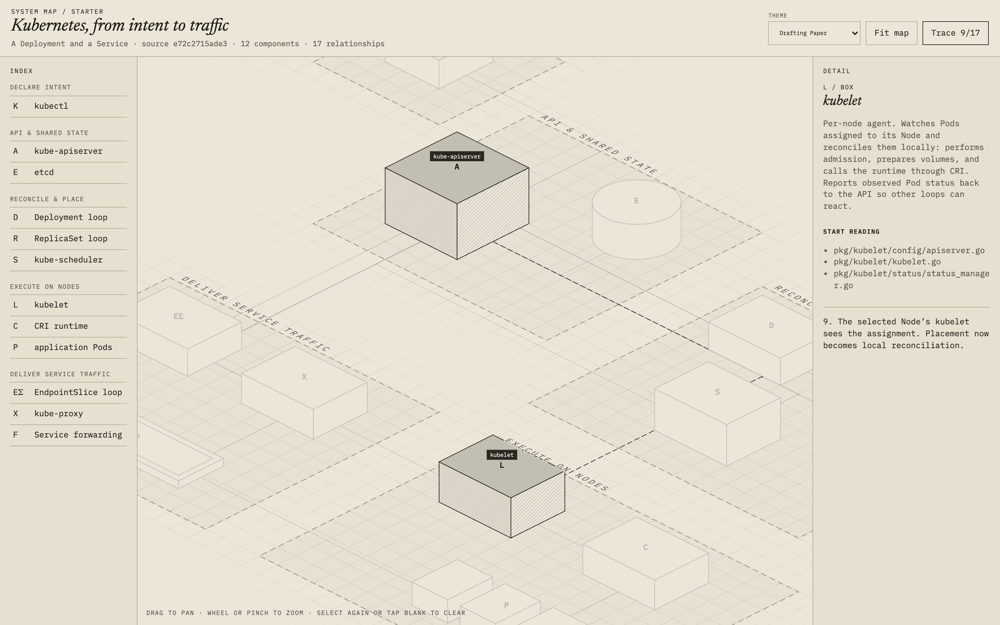
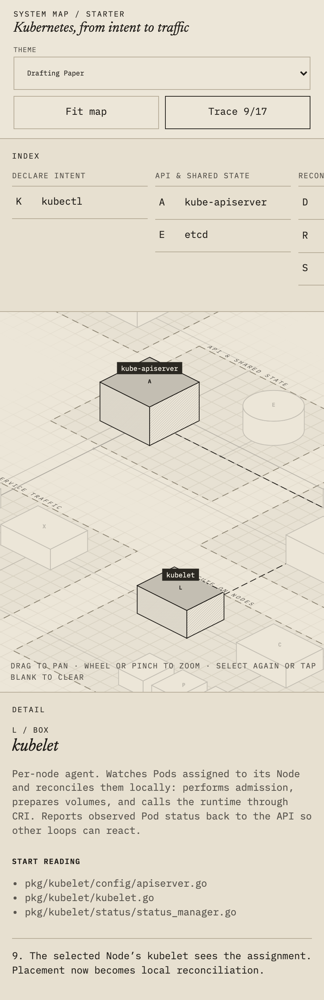

# Isometric system maps — draft

This package contains the authoring workflow in [SKILL.md](SKILL.md) and the approved
[starter](assets/starter/): the page, map data, renderer, geometry and its existing
test file, styles, and bundled fonts. It is not installed into active skill
directories or published to the skill registry.

The default [map data](assets/starter/data.js) follows a simplified SQLite
`SELECT`: compile SQL, run bytecode, read uncached pages, and return a result row
to the caller. It is grounded in
[pinned SQLite source](https://github.com/sqlite/sqlite/tree/d92acf1afe6dbd4c8aec9aa9513a518f690c2acf);
source paths in the map are relative to that repository. It is not a complete
transaction or WAL model.

The page's font link is local; font notices are included in
[fonts.css](assets/starter/fonts.css). See [NOTICE](../NOTICE).

## Kubernetes gallery

One successful Deployment and selector-based Service, from declared intent to
traffic. The map follows asynchronous reconciliation, with the Linux in-tree
kube-proxy/iptables path as its networking example—not every runtime or network
implementation. Components and relationships were researched against
[pinned Kubernetes source](https://github.com/kubernetes/kubernetes/tree/e72c2715ade37738aa5c029e8de5285cbe1c9441).

Click any screenshot to view the original.

| Moment | Desktop | Mobile |
| --- | --- | --- |
| **Overview** The entire map. |  |  |
| **Selection** kube-apiserver and all its incident relationships. |  |  |
| **Flow trace** kube-apiserver → kubelet, with automatic zoom and an explainer. |  |  |

Real, unretouched browser captures in the paper theme. Desktop uses a
1600 × 1000 viewport; mobile uses 430 × 932 touch emulation. Both use device
pixel ratio 2. Mobile captures include the full page so the stacked explainer
remains visible.

To reproduce, copy [assets/starter](assets/starter/) into a fresh directory,
replace its `data.js` with [the example input](screenshots/kubernetes/data.js),
and serve that directory over HTTP. No package installation or build is needed;
the starter renderer and styles are unchanged.

## Validation status

An independent agent used the skill to research this example, delegated source
research, and edited only the copied `data.js`. A separate browser agent checked
selection and deselection, flow tracing and automatic zoom, camera fit, theme
switching and persistence, desktop drag/wheel controls, and emulated mobile
touch pan/pinch. No page, console, or network errors were observed, and the
existing geometry test suite passes.

This is evidence from one example, not broad validation of the workflow.
Spatial-judgment guidance remains pending; the package remains a draft and is
not installed into active skill directories or published to the registry.

TODO: Future optional customization or features may use progressively disclosed
supporting Markdown files; none are included now.
