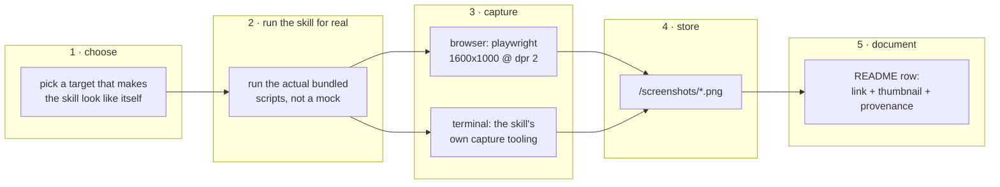

# Skill gallery captures for the README

> Give every skill in this repository a link and a representative screenshot in
> the top-level `README.md`, and add the two skills that are currently missing
> from it entirely.

## Outcome

The root `README.md` becomes a gallery: one row per skill, each row carrying a
link to that skill's `SKILL.md` and a clickable thumbnail of the skill actually
doing its job. A reader who has never opened this repository should be able to
tell what each skill produces without reading any of them.

## Why this is needed

| Problem today | Effect |
| --- | --- |
| `code-orientation` and `nethack-strategy` are not listed at all | Two skills are invisible to anyone reading the README |
| Only `making-isometric-system-maps` has captures | The README is a wall of one-line descriptions |
| Captures live in one skill's own README | There is no single place that shows the whole set |

## Capture standard

Every capture is a real, unretouched screenshot or recording of the skill
running. No mockups, no composites, no retouching. This matches the standard already set by the
Kubernetes gallery in `making-isometric-system-maps/screenshots/kubernetes/README.md`.

- Browser captures: **1600 × 1000 viewport, device pixel ratio 2**.
- Terminal captures: the skill's own capture tooling, at its native geometry.
- Anything derived from an external repository is **pinned to an explicit commit**
  and that commit is recorded beside the image.
- Captures are stored per skill, in `<skill>/screenshots/`, not in a shared
  top-level assets directory. A skill and its evidence stay together.

## Pipeline

## Task list

| # | Skill | Capture subject | Status |
| --- | --- | --- | --- |
| 1 | `code-orientation` | Redis 7.4.1 `SET foo bar` hot path in the local viewer | Done |
| 2 | `presenting-html-plans` | This plan, rendered by the bundled scaffold | Done |
| 3 | `making-isometric-system-maps` | Existing Kubernetes flow-trace capture, reused | Done |
| 4 | `remote-browser-cdp-kvm` | Phone recording of a human solving a CAPTCHA over the KVM | Done |
| 5 | `tui-puppeteering-with-tmux` | The Nori CLI at launch and with its config picker open | Done |
| 6 | `tui-capture-with-ghostty-web` | `bat` rendering this repo's `sloc.py`, text + PNG paired | Done |
| 7 | `nethack` | A live game at turn 31 through the `nh` harness | Done |
| 8 | `README.md` | Assemble the gallery table and add the two missing skills | Done |

### Out of scope

`nethack-strategy` and `nethack-wiki-research` get **link-only rows, no image**.
Both are advisory skills that sit alongside the `nethack` harness; neither has
visual output, so any screenshot would be a picture of text. They are listed,
not illustrated.

## File map

| Path | Change |
| --- | --- |
| `README.md` | Rewritten as the gallery; adds `code-orientation` and `nethack-strategy` |
| `code-orientation/screenshots/redis-set-hot-path.png` | New capture |
| `presenting-html-plans/screenshots/` | New capture |
| `remote-browser-cdp-kvm/screenshots/` | New capture |
| `tui-puppeteering-with-tmux/captures/` | Author-supplied screenshots of the Nori CLI |
| `tui-capture-with-ghostty-web/screenshots/` | New capture |
| `nethack/screenshots/` | New capture |
| `plans/skill-gallery-captures/` | This plan, rendered by `presenting-html-plans` |
| `.gitignore` | Adds `.worktrees/` |

## Verification

1. Every image path referenced by `README.md` resolves to a file that exists.
2. Every skill directory in the repository has a row in the README.
3. Each capture was produced by running that skill's own bundled tooling.
4. External targets carry a pinned commit next to the image.

## Findings

Four things worth keeping, all discovered by running the skills rather than
reading them:

- **The Ghostty Web renderer is excellent at text and colour, and weak at heavy
  block/braille glyphs.** `btop` was the first candidate for its capture and had
  to be rejected: its box borders nearly vanished and its braille CPU graphs came
  out as faint sparse dots, while the tmux text capture of the same screen was
  perfect. `bat` renders flawlessly. Choose capture subjects accordingly.
- **An image is the wrong artifact for `tui-puppeteering-with-tmux`.** Its first
  capture was an `fzf` session rendered to PNG — but that PNG was produced by
  `capture-session`, which belongs to `tui-capture-with-ghostty-web`. Two rows
  would have been illustrated by the same tool, one of them miscredited. The
  puppeteering skill's own output is text, from `tui-capture`, so its row now
  carries a verbatim text block instead. Attribute a capture to the tool that
  actually produced it.
- **`bcdp` hard-coded a 1440×900 tab**, which left a page unreadably small in a
  phone-sized KVM pane. Now configurable via `BCDP_VIEWPORT`, default unchanged.
- **Personal data leaks into TUI captures by default.** `btop`'s process list
  showed running applications, command lines and a username; NetHack read a
  personal `~/.nethackrc`. Both were neutralised for the capture without editing
  anything the user owns — `4` to hide btop's process box, and a throwaway
  `NETHACKOPTIONS` file. The same applies to browser profiles: captures used a
  temporary `BCDP_PROFILE`, never the durable logged-in one.

## Open questions

None outstanding. The `nethack` harness built cleanly (`cargo build --release`,
10s), so it did not need to fall back to a link-only row.
