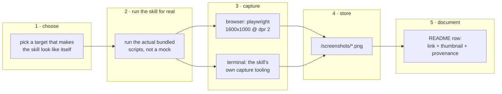

# Skill gallery captures for the README

> Give every skill in this repository a link and a representative screenshot in
> the top-level `README.md`, and add the two skills that are currently missing
> from it entirely.

## Outcome

The root `README.md` becomes a gallery: one row per skill, each row carrying a
link to that skill's `SKILL.md` and a clickable thumbnail of the skill actually
doing its job. A reader who has never opened this repository should be able to
tell what each skill produces without reading any of them.

## Why this is needed

| Problem today | Effect |
| --- | --- |
| `code-orientation` and `nethack-strategy` are not listed at all | Two skills are invisible to anyone reading the README |
| Only `making-isometric-system-maps` has captures | The README is a wall of one-line descriptions |
| Captures live in one skill's own README | There is no single place that shows the whole set |

## Capture standard

Every capture is a real, unretouched screenshot of the skill running. No mockups,
no composites, no retouching. This matches the standard already set by the
Kubernetes gallery in `making-isometric-system-maps/screenshots/kubernetes/README.md`.

- Browser captures: **1600 × 1000 viewport, device pixel ratio 2**.
- Terminal captures: the skill's own capture tooling, at its native geometry.
- Anything derived from an external repository is **pinned to an explicit commit**
  and that commit is recorded beside the image.
- Captures are stored per skill, in `<skill>/screenshots/`, not in a shared
  top-level assets directory. A skill and its evidence stay together.

## Pipeline

## Task list

| # | Skill | Capture subject | Status |
| --- | --- | --- | --- |
| 1 | `code-orientation` | Redis 7.4.1 `SET foo bar` hot path in the local viewer | Done |
| 2 | `presenting-html-plans` | This plan, rendered by the bundled scaffold | In progress |
| 3 | `making-isometric-system-maps` | Existing Kubernetes flow-trace capture, reused | Pending |
| 4 | `remote-browser-cdp-kvm` | A `bcdp` verb driving the shared Chrome, plus the KVM view | Pending |
| 5 | `tui-puppeteering-with-tmux` | An isolated tmux session under assertion | Pending |
| 6 | `tui-capture-with-ghostty-web` | A paired text + Ghostty Web PNG artifact | Pending |
| 7 | `nethack` | A live game screen through the `nh` harness | Pending |
| 8 | `README.md` | Assemble the gallery table and add the two missing skills | Pending |

### Out of scope

`nethack-strategy` and `nethack-wiki-research` get **link-only rows, no image**.
Both are advisory skills that sit alongside the `nethack` harness; neither has
visual output, so any screenshot would be a picture of text. They are listed,
not illustrated.

## File map

| Path | Change |
| --- | --- |
| `README.md` | Rewritten as the gallery; adds `code-orientation` and `nethack-strategy` |
| `code-orientation/screenshots/redis-set-hot-path.png` | New capture |
| `presenting-html-plans/screenshots/` | New capture |
| `remote-browser-cdp-kvm/screenshots/` | New capture |
| `tui-puppeteering-with-tmux/screenshots/` | New capture |
| `tui-capture-with-ghostty-web/screenshots/` | New capture |
| `nethack/screenshots/` | New capture |
| `plans/skill-gallery-captures/` | This plan, rendered by `presenting-html-plans` |
| `.gitignore` | Adds `.worktrees/` |

## Verification

1. Every image path referenced by `README.md` resolves to a file that exists.
2. Every skill directory in the repository has a row in the README.
3. Each capture was produced by running that skill's own bundled tooling.
4. External targets carry a pinned commit next to the image.

## Open questions

- Whether `nethack` can be captured on this machine at all: the Rust harness in
  `nethack/scripts/nh` has no build output here, so it needs `cargo build`
  before a live game can be photographed. If that is unwelcome, `nethack`
  becomes a link-only row like its two companions.
