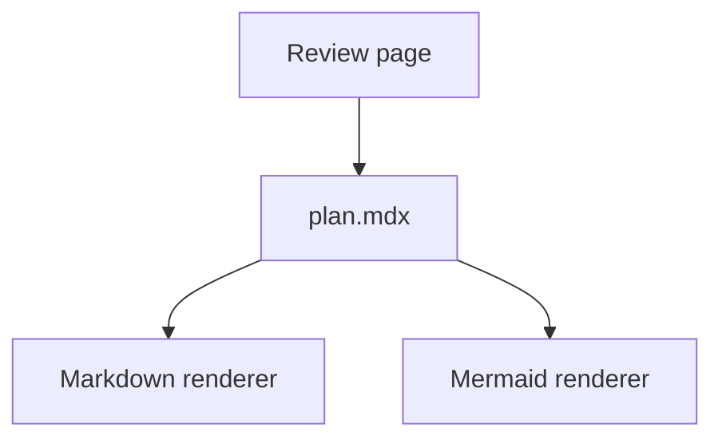

<required>
CRITICAL. Add the following steps to your task list:

1. Obtain the completed plan; use `writing-plans` first if planning is still needed.
2. Copy the bundled scaffold to `plans/SLUG/` and write the plan to `plan.mdx`.
3. Add or improve diagrams only where they clarify an important relationship.
4. Serve the directory locally and inspect the rendered page.
5. Report the source path and preview URL.
</required>

# Presenting Plans as HTML

This skill owns presentation, not planning. Preserve the plan's decisions,
scope, ordering, and level of detail. Do not add approval gates, planning
methodology, hosted services, comments, canvases, or prototypes.

## Quick scaffold

```sh
mkdir -p plans/SLUG
cp -R "{{skills_dir}}/presenting-html-plans/assets/scaffold/." plans/SLUG/
```

Replace `plans/SLUG/plan.mdx` with the completed plan. Keep the file within
the Markdown-compatible subset of MDX: Markdown, fenced code, fenced Mermaid,
tables, images, and simple HTML. The viewer sanitizes rendered HTML and does not
compile JSX components.

Serve the directory with any static server, for example:

```sh
python3 -m http.server 4173 --directory plans/SLUG
```

Open `http://localhost:4173/`. Use `?src=other-plan.mdx` to preview another
top-level `.md` or `.mdx` file in the same directory. Nested and remote source
paths are rejected.

## Presentation rules

- Make the document standalone: remove references that require chat history.
- Preserve the source plan. Reorganize only when scanning materially improves.
- Lead with the outcome. For an abstract product plan, place one concrete
  screenshot or example near the top when one already exists.
- Use headings, short paragraphs, tables, checklists, code, and blockquotes to
  create hierarchy. Prefer a file-map table over an exhaustive prose list.
- Put each diagram beside the claim it explains. Do not repeat the same
  information in both prose and a diagram.
- Keep product screenshots and architecture diagrams separate. Never draw file
  paths, contracts, or implementation annotations inside product UI.
- Keep unresolved questions in one final `Open Questions` section. Do not invent
  questions merely to fill the template.

## Mermaid

Use fenced `mermaid` blocks:

````markdown

````

Choose the diagram form from the relationship:

- `flowchart` for architecture, ownership, dependencies, or data flow.
- `sequenceDiagram` for ordered interactions between actors.
- `stateDiagram-v2` for lifecycle and transition rules.
- `erDiagram` for persistent entities and relationships.

Prefer grouped regions, layers, before/after views, and top-to-bottom layouts.
Use a linear chain only when the relationship is genuinely sequential. Keep
labels short, use real domain terms, and omit diagrams that are less clear than
a small table or paragraph.

## Handoff check

Open the rendered page before sharing it. Check the table of contents, Mermaid
rendering, code overflow, table width, contrast, narrow-screen layout, and print
preview. Fix clipped content, excessive whitespace, and unreadable diagrams.

The scaffold is local and source-control friendly. It fetches pinned versions
of DOMPurify, `marked`, and Mermaid from jsDelivr at preview time. Vendor those
libraries separately when offline operation is required; do not relax the CSP
or remove sanitization to make untrusted content render.
