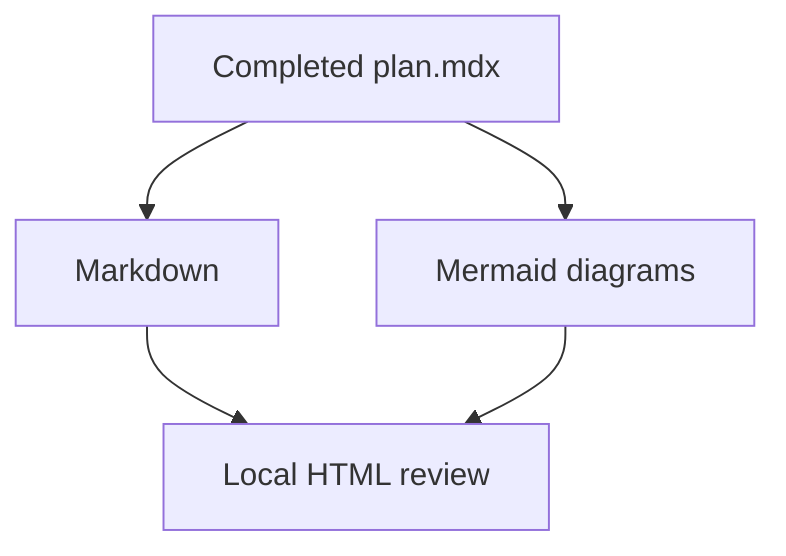

<!-- Replace this file with the completed implementation plan. -->

# Plan preview

> This scaffold renders Markdown-compatible MDX and fenced Mermaid diagrams.

Copy the completed plan from `writing-plans` into this file without changing its
substance.

## Mermaid example

